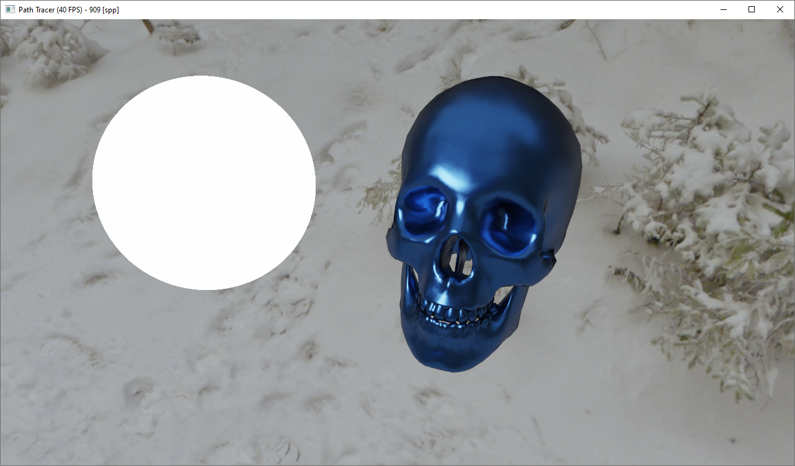
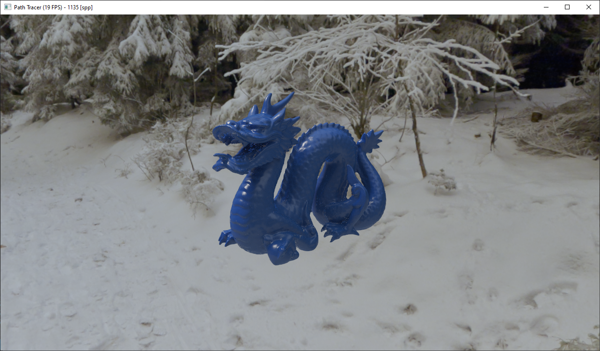
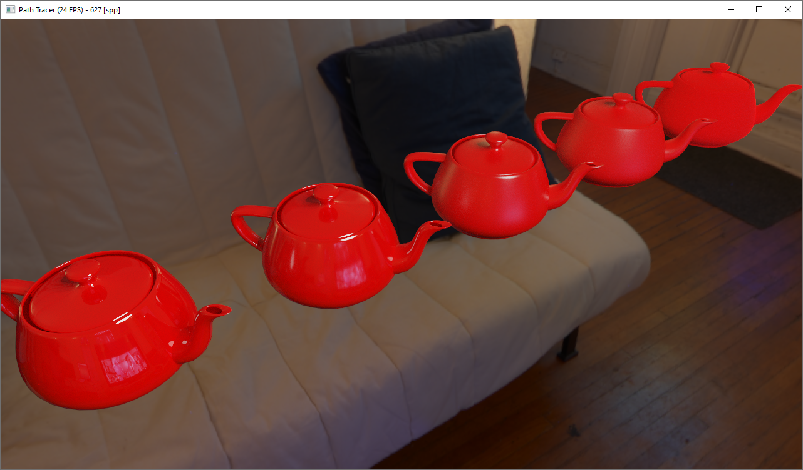
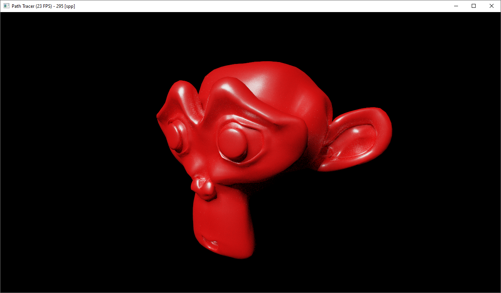
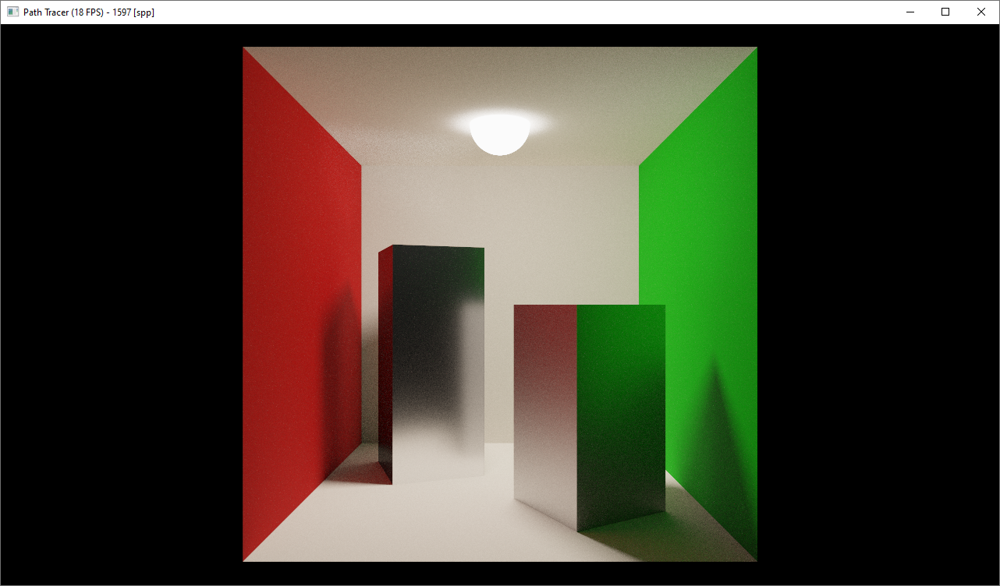
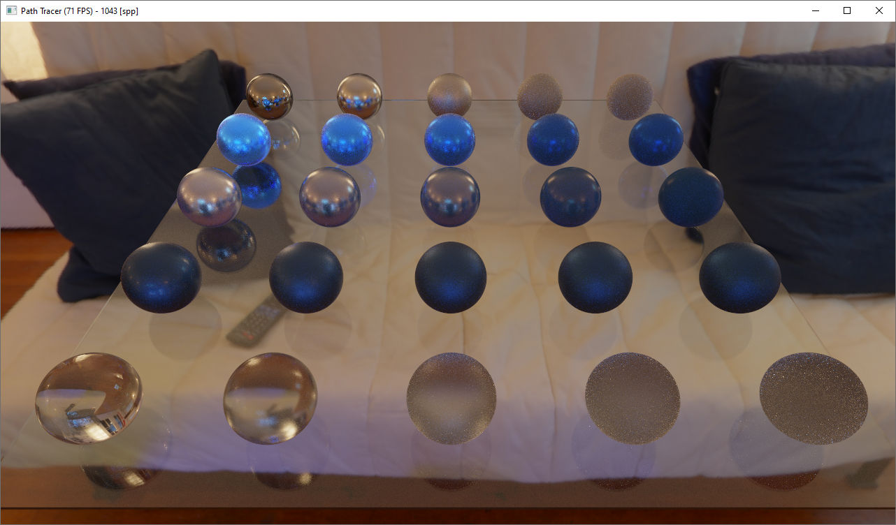

# GPU-Path-Tracer
An implementation of a basic interactive path tracer that runs entirely on the GPU. This project was written in C++ and GLSL, and presents the following features:
- PBR pipeline
- Importance Sampling
- Multiple Importance Sampling
- Wavefront path tracing approach
- IBL
- BVH built considering the Surface Area Heuristic
- Disney's Principled BSDF

## Screenshots

